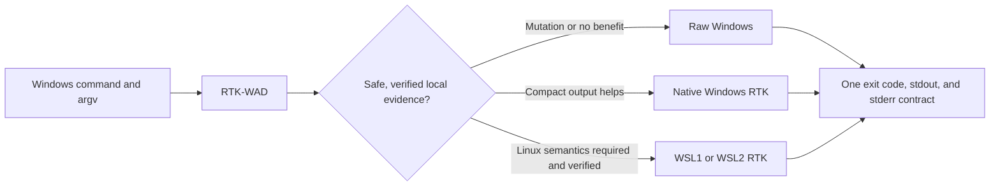
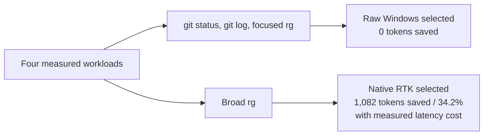

<p align="center">
  
</p>

<h1 align="center">RTK-WAD</h1>

<p align="center">
  <strong>Windows Adaptive Dispatcher for RTK.</strong><br />
  One safe command boundary that chooses raw Windows, native RTK, or a verified WSL route.
</p>

<p align="center">
  <a href="https://github.com/badaruddinl/rtk-wad/actions/workflows/windows-ci.yml"></a>
  <a href="https://github.com/badaruddinl/rtk-wad/tags"></a>
  <a href="LICENSE"></a>
  <a href="docs/RELEASE_GATE_P20.md"></a>
</p>

RTK-WAD is a native Windows launcher for [RTK](https://github.com/rtk-ai/rtk).
It preserves arguments as structured process arguments—never by rebuilding a
shell command string—and chooses one auditable execution route for each command.
It is designed for Windows developers who need RTK's compact output without
blindly paying a WSL bridge cost or risking cross-shell quoting failures.

> **Stable baseline.** The current release is `v0.2.0`. The canonical
> repository, package, and executable are `rtk-wad`. `rtk-wsl` and `rtk-wsl1`
> remain compatibility aliases for existing local integrations.

## Why RTK-WAD



| Route | When RTK-WAD uses it | What it protects |
| --- | --- | --- |
| Raw Windows | Mutations, unknown commands, or no measured RTK benefit | Lowest avoidable latency; native Windows toolchain behavior |
| Native RTK | A verified read-only command has a useful compact-output result | RTK filtering without a WSL bridge |
| WSL RTK | A verified provider and path mapping require Linux semantics | Structured cross-host execution, not ad-hoc shell quoting |

The dispatcher never replays a command merely to train its policy. Mutating
commands do not become adaptive. Provider discovery is local-first and does not
install a language runtime or tool automatically.

## Quick start

Build a release binary on Windows:

```powershell
cargo build --release
.\target\release\rtk-wad.exe --version
.\target\release\rtk-wad.exe --explain-route rg -n "pattern" src
```

Install it for the current user:

```powershell
.\scripts\install.ps1
rtk-wad gain
```

The core installer has no Python or tokenizer dependency. The pinned
[`tiktoken`](requirements/wad-tokenizer.txt) environment is optional and used
only to reproduce benchmark token counts. Install it explicitly when running a
benchmark; it never alters the global Python environment. On a fresh PC without
Python, inspect the plan first:

```powershell
.\scripts\install-tokenizer.ps1 -PlanPythonBootstrap
```

Only `-InstallTokenizer -InstallPython -ConfirmPythonInstall` can install the
documented Python dependency together with the optional tokenizer.

To prevent automatic WSL selection for a Windows-only workflow, use the
per-command environment mode. It keeps RTK meta commands on native RTK and
runs unverified external commands directly on Windows:

```powershell
rtk-wad --environment windows-only --explain-route pytest -q
$env:RTK_WAD_ENVIRONMENT = "windows-only"
```

## Agent hook adapter (Claude Code)

RTK-WAD provides a conservative adapter for the native RTK Claude hook. It
delegates rewrite decisions to stock RTK, then changes only an emitted
`rtk ...` command into `rtk-wad ...`; it does not parse or rebuild agent shell
commands itself. The registration is deliberately opt-in so existing agent
hooks are not silently changed:

```powershell
rtk-wad agent integration claude
```

Follow the printed three-step setup, then use `rtk-wad agent hook claude` as
the hook command. See [agent integration](docs/AGENT_INTEGRATION.md) for the
supported boundary and failure behavior.

## A route decision you can inspect

RTK-WAD exposes the policy decision instead of hiding it. This is a captured
local example from the repository's current release binary; another machine or
command form may choose differently.

```text
> rtk-wad --explain-route rg -n RTK_WAD src
route=native-rtk
reason=local calibration candidate: first safe observation uses native RTK
command_family=rg
```

Use `rtk-wad policy show` and `rtk-wad calibration show` to inspect the local
evidence behind later decisions.

## Benchmark result: token saving *and* latency

The public benchmark does not claim that RTK-WAD is universally faster. It uses
five warmed measurements on the recorded Windows host and `tiktoken==0.12.0`
over combined stdout and stderr. `Tokens saved` is always `raw tokens -
RTK-WAD auto tokens` for the same command form.

| Workload | Raw Windows | RTK-WAD auto | Raw → auto tokens | Tokens saved | Saving | Automatic route |
| --- | ---: | ---: | ---: | ---: | ---: | --- |
| `git status --short --branch` | 127.613 ms | 266.283 ms | 37 → 37 | 0 | 0.0% | Raw |
| `git log --oneline -100` | 126.856 ms | 309.754 ms | 864 → 864 | 0 | 0.0% | Raw |
| Focused `rg` | 71.723 ms | 138.457 ms | 94 → 94 | 0 | 0.0% | Raw |
| Broad `rg` | 69.994 ms | 293.102 ms | 3,164 → 2,082 | 1,082 | 34.2% | Native RTK |



Three of four measured workloads save no tokens, so RTK-WAD keeps them raw.
Broad `rg` saves 1,082 tokens (34.2%) and clears the documented 25% token-first
threshold despite being slower on this host. See the versioned
[comparison and methodology](docs/BENCHMARK_COMPARISON_P20.md), the
[full Windows/WSL matrix](docs/BENCHMARK_CORE_MATRIX_P18_2026-07-25.md), and
[machine-readable evidence](benchmarks/evidence/p18-comparison-summary.json).
A separate [public ripgrep corpus measurement](docs/P21_PUBLIC_RIPGREP_BENCHMARK.md)
records a zero-saving result; it is retained precisely because benchmark claims
must remain corpus-specific and falsifiable.

### Read `gain` honestly

`rtk-wad gain` is local RTK tracker accounting, not a benchmark runner and not
a raw-token estimator. It reports all invocations, but only native/WSL RTK
routes contribute RTK-measured token fields. Raw-route invocations are retained
as explicitly **unmeasured**; RTK-WAD does not invent a token estimate for them.

Token saving is also not a promise of lower API cost or lower latency. Prompt,
system, conversation, output, and model pricing all affect an eventual bill.

## Windows and WSL safety contract

- Exact argv forwarding handles spaces, quotes, Unicode, `&`, `;`, `$`, and
  backslashes without shell reconstruction.
- Drive CWD mapping, exit code propagation, stdout/stderr, Ctrl+C, child
  processes, and lock release have automated process-contract coverage.
- WSL use requires an explicit verified provider and path mapping. WSL1 and
  WSL2 are measured routes, not a default performance claim.
- Existing Windows and WSL tool installations can be diagnosed on demand.
  Installation is always separately planned and confirmed.

## Documentation

| Topic | Reference |
| --- | --- |
| Routing, configuration, and local accounting | [RTK-WAD contract](docs/RTK_WAD.md) |
| Public benchmark comparison | [P20 comparison](docs/BENCHMARK_COMPARISON_P20.md) |
| Public external-corpus benchmark | [P21 ripgrep evidence](docs/P21_PUBLIC_RIPGREP_BENCHMARK.md) |
| Full native Windows, WSL1, and WSL2 matrix | [P18 core matrix](docs/BENCHMARK_CORE_MATRIX_P18_2026-07-25.md) |
| Provider discovery, mapping, and execution | [Provider documentation index](docs/README.md#cross-host-providers-and-setup) |
| Fresh-machine tokenizer dependency | [Runtime dependencies](docs/DEPENDENCIES.md) |
| Claude Code adapter | [Agent integration](docs/AGENT_INTEGRATION.md) |
| Controlled Windows/WSL evidence | [Self-hosted WSL CI](docs/SELF_HOSTED_WSL_CI.md) |
| Artifact provenance and signing readiness | [Release provenance](docs/RELEASE_PROVENANCE.md) |
| Installation, rollback, and uninstall | [Packaging/recovery contract](tests/packaging-contract.ps1) |
| Full local alpha verification | [P20 release gate](docs/RELEASE_GATE_P20.md) |
| Alpha delivery history | [Milestone documents](docs/README.md#release-and-project-history) |

## Verify from source

```powershell
cargo fmt --check
cargo test
cargo clippy -- -D warnings
.\scripts\verify-release.ps1
```

The release gate covers Rust checks, process contracts, tokenizer bootstrap,
packaging/recovery, setup readiness, exact Windows/WSL provider preflight,
command-surface parity, and crate hygiene.

## License and upstream boundary

RTK-WAD is Apache-2.0 licensed to match RTK. It is not an official RTK package
and remains `publish = false`. Potential upstream contributions must target
RTK's `develop` branch, be scoped and tested independently, and comply with
its contributor requirements.
