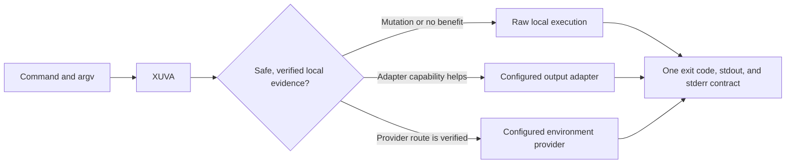
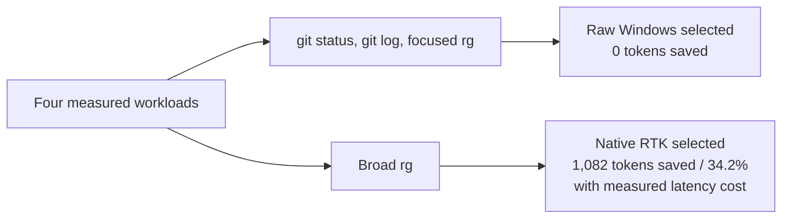

<p align="center">
  
</p>

<h1 align="center">XUVA</h1>

<p align="center">
  <strong>Adaptive command dispatcher.</strong><br />
  One safe command boundary with explainable route selection across local and configured environments.
</p>

<p align="center">
  <a href="https://github.com/badaruddinl/xuva/actions/workflows/windows-ci.yml"></a>
  <a href="https://github.com/badaruddinl/xuva/tags"></a>
  <a href="LICENSE"></a>
  <a href="docs/RELEASE_GATE_P20.md"></a>
</p>

XUVA is an adaptive command dispatcher. For each command, it selects one
auditable route from the available local and configured providers. It preserves
arguments as structured process arguments and keeps execution local when
another route does not provide verified value.

> **Hard cutover.** Starting with `v0.4.1`, the project, repository, binary,
> installer, environment variables, and state paths use `xuva`. There is no
> legacy launcher in this release line. GitHub redirects the former repository
> URL for historic tags and evidence.

## Why XUVA



| Route | When XUVA uses it | What it protects |
| --- | --- | --- |
| Raw local | Mutations, unknown commands, or no verified adapter benefit | Lowest avoidable latency and original tool behavior |
| Output adapter | A verified read-only command has a useful adapted result | Compact output without shell reconstruction |
| Environment provider | A verified provider and path mapping require another environment | Structured cross-host execution, not ad-hoc shell quoting |

The dispatcher never replays a command merely to train its policy. Mutating
commands do not become adaptive. Provider discovery is local-first and does not
install a language runtime or tool automatically.

### Optional integration

[RTK](https://github.com/rtk-ai/rtk) is an optional output-adapter dependency.
When it is installed and a verified route benefits from it, XUVA can select it;
otherwise XUVA continues with raw or other verified provider routes.

## Download the verified Windows binary

The current Windows x86_64 release is `v0.4.1`, using the XUVA product and
archive names. Development after that release is versioned as a beta until the
same source SHA completes the hosted and controlled Windows/WSL release gates.
The archive is not Authenticode-signed; see [release
provenance](docs/RELEASE_PROVENANCE.md) for the explicit trust boundary.

Supported public-beta runtime targets are Windows 10/11 x86_64 with PowerShell
5.1 or newer. Cross-host routes support Ubuntu under WSL1 or WSL2 when that
distro and its project mapping are verified. Other distributions can be
discovered, but are not part of the release gate. Source builds require Rust
1.95.0 or newer; official binaries use the pinned Rust 1.97.1 toolchain.

- [Download the v0.4.1 Windows archive](https://github.com/badaruddinl/xuva/releases/download/v0.4.1/xuva-v0.4.1-windows-x86_64.zip)
- [Download its SHA-256 sidecar](https://github.com/badaruddinl/xuva/releases/download/v0.4.1/xuva-v0.4.1-windows-x86_64.zip.sha256)
- [Open the v0.4.1 release record](https://github.com/badaruddinl/xuva/releases/tag/v0.4.1)

Verify the archive after downloading it:

```powershell
Get-FileHash .\xuva-v0.4.1-windows-x86_64.zip -Algorithm SHA256
Get-Content .\xuva-v0.4.1-windows-x86_64.zip.sha256
```

Every stable release also requires successful hosted quality gates and a
recorded self-hosted [Windows/WSL process-contract run](docs/SELF_HOSTED_WSL_CI.md)
for the release commit.

## Quick start

Build a release binary on Windows:

```powershell
cargo build --release --locked --bins
.\target\release\xuva.exe --version
.\target\release\xuva.exe --explain-route rg -n "pattern" src
```

Run this self-build through Cargo directly (or from a different XUVA binary).
Windows cannot replace `target\release\xuva.exe` while that same executable is
still acting as the dispatcher for the build.

Install it for the current user:

```powershell
.\scripts\install.ps1 -AddToPath
xuva gain
xuva self-update --check
```

Use `xuva install --status` to inspect the installation, `xuva rollback` to
swap to the retained previous complete bundle after the current process exits,
and `xuva uninstall --remove-from-path` to remove both bundle generations and
their PATH entry.
The default installation is the dedicated managed directory
`%LOCALAPPDATA%\Programs\XUVA`, never the shared `%USERPROFILE%\.local\bin`.
Every managed generation has a validated `.xuva-installation.json` ownership
marker; upgrade, rollback, and uninstall refuse a directory containing foreign
or missing files. A legacy `.local\bin\xuva.exe` is reported but never moved or
deleted automatically.

The companion scripts expose the same operations for recovery when the binary
cannot start. After an interrupted filesystem transaction, run
`.\scripts\install.ps1 -Recover` (or the installed `install.ps1 -Recover`)
before retrying the operation. The installer performs `xuva scan` after
activating the binary. It
inventories every launchable executable on the Windows `PATH` and the WSL
distros that actually exist, without executing those tools, installing a
toolchain, or forcing WSL. The dispatcher resolves and caches any safe
executable name on demand; use `xuva scan nvm rustc` to refresh named
providers across Windows and WSL explicitly.

The installer smoke-tests the candidate binary before activation and restores
the previous complete bundle if copying, activation, PATH update, or the
post-install provider scan fails. Official archives are checksum- and
metadata-verified before any activation. `self-update`
is deliberately diagnostic-only: `--check` queries stable tags through Git for
Windows, while installation still requires a reviewed release or trusted
checkout.

The core installer has no Python or tokenizer dependency. The pinned
[`tiktoken`](requirements/xuva-tokenizer.txt) environment is optional and used
only to reproduce benchmark token counts. Install it explicitly when running a
benchmark; it never alters the global Python environment. On a fresh PC without
Python, inspect the plan first:

```powershell
.\scripts\install-tokenizer.ps1 -PlanPythonBootstrap
```

Only `-InstallTokenizer -InstallPython -ConfirmPythonInstall` can install the
documented Python dependency together with the optional tokenizer.

To prevent automatic WSL selection for a Windows-only workflow, use the
per-command environment mode. It keeps RTK meta commands on native RTK and
runs unverified external commands directly on Windows:

```powershell
xuva --environment windows-only --explain-route pytest -q
$env:XUVA_ENVIRONMENT = "windows-only"
```

## Agent hook adapters

XUVA provides conservative adapters for the native RTK hooks used by Claude
Code, Cursor, Gemini CLI, and GitHub Copilot. Each adapter delegates rewrite
decisions to stock RTK, then changes only an emitted
`rtk ...` command into `xuva ...`; it does not parse or rebuild agent shell
commands itself. The registration is deliberately opt-in so existing agent
hooks are not silently changed:

```powershell
xuva agent integration claude
xuva agent integration cursor
xuva agent integration gemini
xuva agent integration copilot
```

Follow the printed three-step setup, then use the matching `xuva agent hook
<agent>` command in the hook registration. See [agent
integration](docs/AGENT_INTEGRATION.md) for the supported boundary and failure
behavior.

## A route decision you can inspect

XUVA exposes the policy decision instead of hiding it. This is a captured
local example from the repository's current release binary; another machine or
command form may choose differently.

```text
> xuva --explain-route rg -n XUVA src
route=native-rtk
reason=local calibration candidate: first safe observation uses native RTK
command_family=rg
```

Use `xuva policy show` and `xuva calibration show` to inspect the local
evidence behind later decisions.

Set `XUVA_POLICY_OBJECTIVE=latency`, `balanced`, or `tokens` to choose the
evidence objective. `balanced` is the default and retains the documented 25%
token-saving threshold; `latency` chooses the lower measured median, while
`tokens` prefers any measured positive token saving. Objective identity is part
of the local evidence context, so changing it cannot reuse an incompatible
calibration decision.

## Benchmark result: token saving *and* latency

The public benchmark does not claim that XUVA is universally faster. It uses
five warmed measurements on the recorded Windows host and `tiktoken==0.12.0`
over combined stdout and stderr. `Tokens saved` is always `raw tokens -
XUVA auto tokens` for the same command form.

| Workload | Raw Windows | XUVA auto | Raw → auto tokens | Tokens saved | Saving | Automatic route |
| --- | ---: | ---: | ---: | ---: | ---: | --- |
| `git status --short --branch` | 127.613 ms | 266.283 ms | 37 → 37 | 0 | 0.0% | Raw |
| `git log --oneline -100` | 126.856 ms | 309.754 ms | 864 → 864 | 0 | 0.0% | Raw |
| Focused `rg` | 71.723 ms | 138.457 ms | 94 → 94 | 0 | 0.0% | Raw |
| Broad `rg` | 69.994 ms | 293.102 ms | 3,164 → 2,082 | 1,082 | 34.2% | Native RTK |



Three of four measured workloads save no tokens, so XUVA keeps them raw.
Broad `rg` saves 1,082 tokens (34.2%) and clears the documented 25% token-first
threshold despite being slower on this host. See the versioned
[comparison and methodology](docs/BENCHMARK_COMPARISON_P20.md), the
[full Windows/WSL matrix](docs/BENCHMARK_CORE_MATRIX_P18_2026-07-25.md), and
[machine-readable evidence](benchmarks/evidence/p18-comparison-summary.json).
A separate [public ripgrep corpus measurement](docs/P21_PUBLIC_RIPGREP_BENCHMARK.md)
records a zero-saving result; it is retained precisely because benchmark claims
must remain corpus-specific and falsifiable.

### Read `gain` honestly

`xuva gain` is local RTK tracker accounting, not a benchmark runner and not
a raw-token estimator. It reports all invocations, but only native/WSL RTK
routes contribute RTK-measured token fields. Raw-route invocations are retained
as explicitly **unmeasured**; XUVA does not invent a token estimate for them.

Token saving is also not a promise of lower API cost or lower latency. Prompt,
system, conversation, output, and model pricing all affect an eventual bill.

## Windows and WSL safety contract

- Exact argv forwarding handles spaces, quotes, Unicode, `&`, `;`, `$`, and
  backslashes without shell reconstruction.
- Native `.exe` arguments remain direct process argv. Windows `.cmd` and `.bat`
  providers accept literal percent, exclamation, caret, quote, empty, and
  trailing-backslash arguments under the Windows batch boundary, but reject CR
  or LF before process creation.
- Paths are translated only in command-defined path positions (`git -C`,
  Cargo manifest/target flags, Go path flags, response files, and Git
  pathspecs). Generic data that merely resembles a path remains unchanged.
- Git operations in Windows worktrees use Git for Windows for NTFS object
  writes, credentials, and Windows DNS. Mutations never fall back to WSL.
- POSIX utilities such as `find`, `head`, and `tail` use raw WSL executables;
  a same-named Windows system tool is not treated as semantically compatible.
- Drive CWD mapping, complete 32-bit Windows exit-code propagation,
  stdout/stderr, Ctrl+C, child processes, and lock release have automated
  process-contract coverage.
- WSL1 and WSL2 use an attest-then-permit launch handshake. A target cannot
  begin until the parent has observed its cancellation boundary, so an
  immediate Ctrl+C cannot leave a command starting in the background.
- WSL2 cancellation state lives under a nonce-named file in a non-symlink,
  user-owned `0700` runtime directory; token files are regular, user-owned
  `0600` files and are removed after completion.
- WSL use requires an explicit verified provider and path mapping. WSL1 and
  WSL2 are measured routes, not a default performance claim.
- Existing Windows and WSL tool installations can be diagnosed on demand.
  Installation is always separately planned and confirmed.

When invoking the Windows dispatcher from a WSL shell, use the provided shim so
the originating distro, physical CWD, Windows-mounted CWD when available, and
structured argv are retained:

```sh
export XUVA_WINDOWS_EXE=/mnt/c/tools/xuva.exe
sh /mnt/c/tools/xuva-wsl.sh go version
```

Set `XUVA_WSL_EXTRA_PATH` only when a WSL-only tool lives outside that distro's
normal `PATH`. The shim is required because WSL does not forward arbitrary
Linux environment variables to Windows `.exe` processes.

Cross-host children start from a clean environment. XUVA forwards a small
safe set (`CI`, color controls, `TERM`, and `RUST_BACKTRACE`), boolean
`*_RUN_*` feature gates such as `XPDE_RUN_TRAINING_E2E=1`, and names explicitly
listed in the comma-separated `XUVA_ENV_ALLOWLIST`. Credential-like names are
rejected even when they resemble a feature gate or appear in the allowlist.

Local aggregate metrics are enabled by default and never leave the workstation.
Set `XUVA_METRICS=off` for a zero-ledger fast path; XUVA then skips both the
SQLite metrics write and local calibration updates for that invocation.

Build identity is inspectable without WSL or provider discovery:

```powershell
xuva --version --verbose
```

It reports the package version, source commit, target, build profile, and
provenance channel embedded at build time.

## Documentation

| Topic | Reference |
| --- | --- |
| XUVA command migration and compatibility | [Migration notes](docs/XUVA_MIGRATION.md) |
| Routing, configuration, and local accounting | [XUVA contract](docs/XUVA.md) |
| Public benchmark comparison | [P20 comparison](docs/BENCHMARK_COMPARISON_P20.md) |
| Public external-corpus benchmark | [P21 ripgrep evidence](docs/P21_PUBLIC_RIPGREP_BENCHMARK.md) |
| Public Node-package benchmark | [P21 TypeScript `npm run` evidence](docs/P21_PUBLIC_TYPESCRIPT_NPM_BENCHMARK.md) |
| Public pytest capability | [P21 pytest evidence gap](docs/P21_PUBLIC_PYTEST_CAPABILITY.md) |
| Full native Windows, WSL1, and WSL2 matrix | [P18 core matrix](docs/BENCHMARK_CORE_MATRIX_P18_2026-07-25.md) |
| Provider discovery, mapping, and execution | [Provider documentation index](docs/README.md#cross-host-providers-and-setup) |
| Fresh-machine tokenizer dependency | [Runtime dependencies](docs/DEPENDENCIES.md) |
| Claude Code adapter | [Agent integration](docs/AGENT_INTEGRATION.md) |
| Controlled Windows/WSL evidence | [Self-hosted WSL CI](docs/SELF_HOSTED_WSL_CI.md) |
| Artifact provenance and signing readiness | [Release provenance](docs/RELEASE_PROVENANCE.md) |
| Installation, rollback, and uninstall | [Packaging/recovery contract](tests/packaging-contract.ps1) |
| Full local alpha verification | [P20 release gate](docs/RELEASE_GATE_P20.md) |
| Alpha delivery history | [Milestone documents](docs/README.md#release-and-project-history) |

## Verify from source

```powershell
cargo fmt --check
cargo test
cargo clippy -- -D warnings
.\scripts\verify-release.ps1
```

The release gate covers Rust checks, process contracts, tokenizer bootstrap,
packaging/recovery, setup readiness, exact Windows/WSL provider preflight,
command-surface parity, and crate hygiene.

## License and upstream boundary

XUVA is Apache-2.0 licensed to match RTK. It is not an official RTK package
and remains `publish = false`. Potential upstream contributions must target
RTK's `develop` branch, be scoped and tested independently, and comply with
its contributor requirements.
