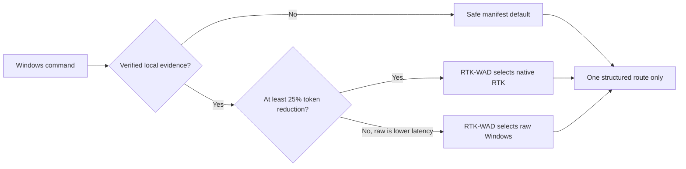
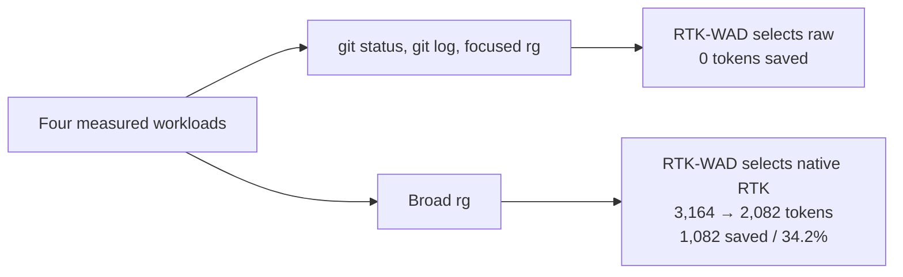

# P20 benchmark comparison: raw Windows, stock RTK, and RTK-WAD

This is the version-controlled, concise presentation of the P18 core evidence.
The machine-readable summary is
[`benchmarks/evidence/p18-comparison-summary.json`](../benchmarks/evidence/p18-comparison-summary.json).
It is deliberately narrower than a universal performance claim: every value is
for the exact command form, Windows host, provider paths, warmed corpus, and
five rotating measurements in the source record.

## What RTK-WAD actually chooses

## Native Windows measurements

| Workload | Raw Windows | Stock RTK | RTK-WAD native candidate | RTK-WAD auto | Raw → auto tokens | Tokens saved | Saving | Honest automatic decision |
| --- | ---: | ---: | ---: | ---: | ---: | ---: | ---: | --- |
| `git status --short --branch` | 127.613 ms | 393.760 ms | 518.466 ms | 266.283 ms | 37 → 37 | 0 | 0.0% | Raw: lower latency; no reduction. |
| `git log --oneline -100` | 126.856 ms | 209.866 ms | 346.381 ms | 309.754 ms | 864 → 864 | 0 | 0.0% | Raw: lower latency; no reduction. |
| Focused `rg` | 71.723 ms | 158.591 ms | 291.880 ms | 138.457 ms | 94 → 94 | 0 | 0.0% | Raw: lower latency; no reduction. |
| Broad `rg` | 69.994 ms | 157.517 ms | 288.386 ms | 293.102 ms | 3,164 → 2,082 | 1,082 | 34.2% | Native RTK: token threshold met; slower. |

The table is intentionally not a marketing aggregate. Three of four listed
workloads are faster raw Windows operations with **zero tokens saved**, so WAD
keeps them raw. The broad search is slower through RTK-WAD auto on this host,
but it saves **1,082 measured output tokens (34.2%)** and therefore meets the
documented token-first policy threshold.

`Tokens saved` is always calculated against the raw Windows token count for
the same workload: `raw_tokens - rtk_wad_auto_tokens`. The machine-readable
evidence also retains the equivalent stock-RTK saving field so downstream
reporting can compare the dispatcher and stock RTK without inventing a token
estimate for an unmeasured route.

## Reading `rtk-wad gain` honestly

`gain` is local RTK-tracker accounting, not a benchmark runner and not a raw
token estimator. It reports all invocation counts, but only native/WSL RTK
routes can contribute measured commands, input/output tokens, or RTK-reported
tokens avoided. Raw routes remain explicitly unmeasured with zero token fields.

Therefore use the benchmark table above for a raw-versus-RTK-WAD comparison and
use `gain` only to inspect the local measured RTK activity of the current
machine. Neither output promises a speed gain outside the recorded workload.

## WSL boundary

The separate P18 bridge matrix found WSL1 and WSL2 slower than raw Windows for
all four warmed core workloads. Broad `rg` saved 36.3% through WSL1 and 35.3%
through WSL2, but those token results do not make WSL a speed claim. See the
[full P18 core matrix](BENCHMARK_CORE_MATRIX_P18_2026-07-25.md) for bridge
latency and scope limitations.
